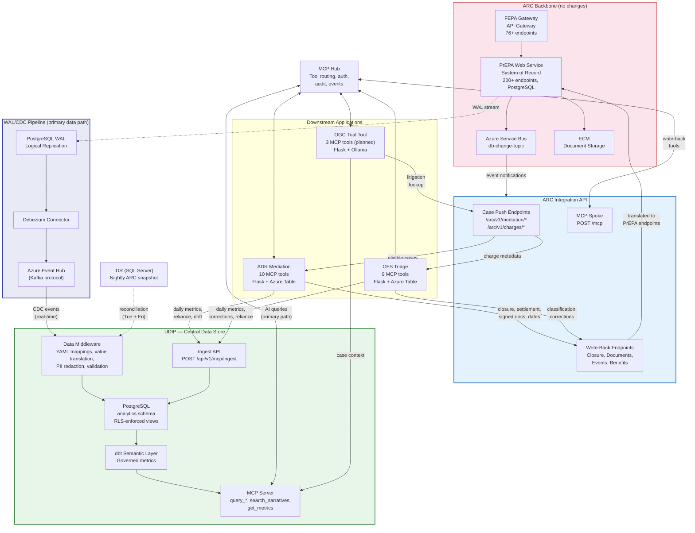
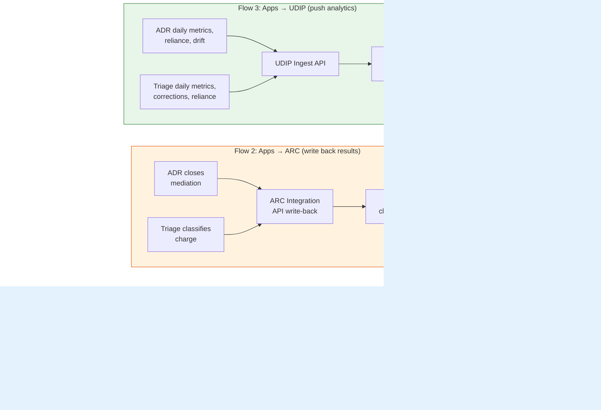
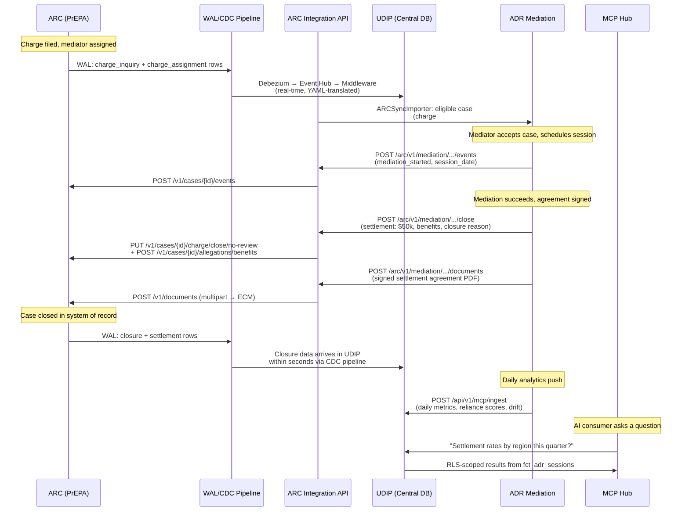
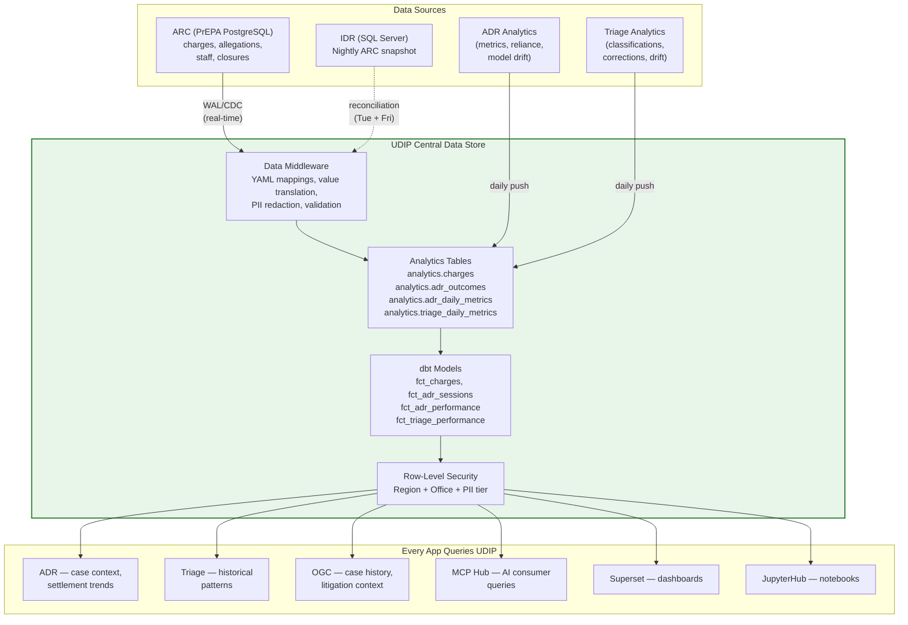
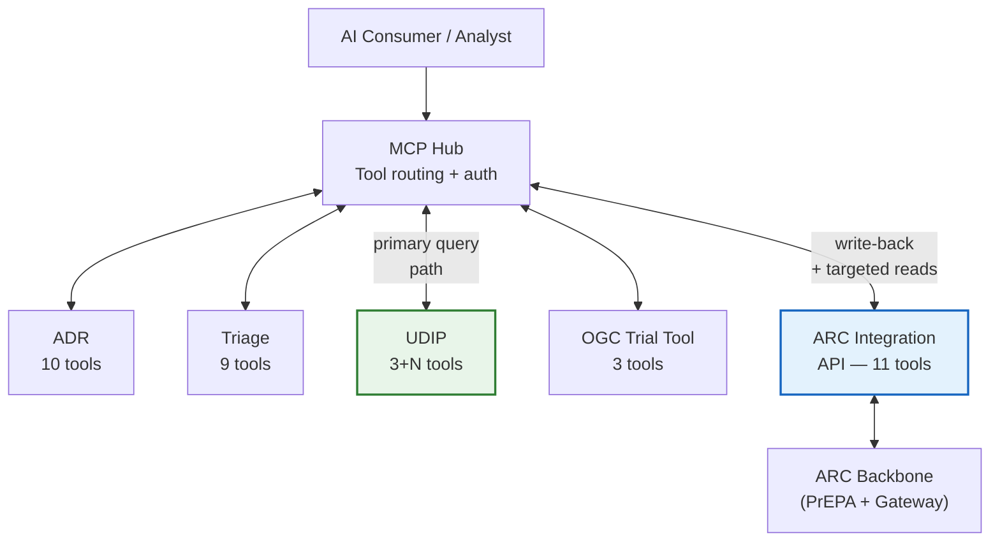
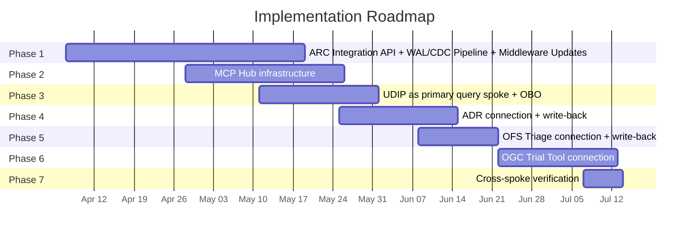

# ARC Integration & MCP Hub: Briefing for OCIO Leadership

**From:** Derek
**Date:** 2026-03-30
**Read time:** ~15 minutes
**Action requested:** Review and alignment on path forward

---

## The Short Version

We reviewed all six codebases involved in the ARC-to-application integration effort: the two ARC backbone services (FEPA Gateway and PrEPA), and the four downstream applications (ADR Mediation, OFS Triage, UDIP Analytics, and OGC Trial Tool). We also reviewed the existing MCP Hub integration planning document.

The core finding: **ARC was never built to serve these downstream applications.** Both ARC services were designed for the IMS Angular frontend and FEPA partner agencies. The four apps have each independently worked around this -- one polls an endpoint that does not exist, one bypasses the API entirely and reads from SQL Server, and two have no ARC integration at all.

The MCP Hub integration plan is solid on the spoke side (the three apps it covers are well-built and ready to connect), but it has a blind spot: it never addresses how the hub actually gets case data from ARC.

We are proposing a clean path forward that fills this gap without disrupting any existing systems.

---

## The Full Picture at a Glance

This diagram shows every data flow in the proposed architecture -- what feeds UDIP, what writes back to ARC, and where each app fits.

---

## How Data Flows in Each Direction

Three distinct flows make up the full integration. Each one serves a different purpose.

---

## What a Mediation Case Lifecycle Looks Like End-to-End

This is the concrete example: a charge arrives in ARC, goes through mediation in ADR, and the results flow back.

---

## What We Found

### ARC: Two Services, 276+ Endpoints, Zero Designed for Us

**FEPA Gateway** is a Java/Spring Boot API gateway sitting in front of PrEPA and five other backend services. It handles authentication (OAuth2, Login.gov), routes requests, and manages document operations through ECM. 76+ endpoints, all built for the IMS Angular app and FEPA state agency partners.

**PrEPA Web Service** is the system of record for discrimination charges. PostgreSQL database, 200+ REST endpoints, 16 scheduled background jobs, Azure Service Bus event publishing. It manages the full charge lifecycle from initial inquiry through closure, including mediation, enforcement, and litigation.

Neither service exposes an API for downstream application consumption. The closest thing is PrEPA's Service Bus event stream (`db-change-topic`), which publishes case change events -- but today, only the IMS ecosystem subscribes to it.

### The Four Applications: Varying Levels of Readiness

**ADR Mediation Platform** -- the most integration-ready. Full MCP server (10 tools, 5 resources), dual authentication (Entra ID + Login.gov), production-grade audit logging with NARA 7-year retention. It already has an ARC sync module that polls for mediation-eligible cases every 15 minutes, but the ARC endpoint it calls does not exist in the codebase we reviewed.

**OFS Triage** -- well-built MCP server (9 tools, 7 resources), strong security posture, but zero connection to ARC. Analysts manually type in charge numbers and metadata. The system classifies charges using local AI (GPT-4o) and has no way to auto-populate case data from ARC.

**UDIP Analytics** -- the agency's analytics platform replacing Tableau and Power BI. Full MCP server with dynamic tool generation from dbt models. It has a production Data Middleware layer with YAML-based column mapping, value translation (converting ARC's cryptic internal codes to human-readable labels), PII redaction, and schema validation. However, it currently gets its charge data from the IDR (a nightly SQL Server snapshot of ARC), bypassing the API layer entirely. It also has a row-level security model tied to the caller's regional identity, which creates a real technical constraint for hub integration (more on this below).

**OGC Trial Tool** -- earliest stage. Litigation support tool for trial attorneys, running local LLM inference (Ollama) for case analysis. No MCP server, no ARC integration, and still using demo session-based authentication instead of Entra ID.

### The MCP Hub Document: Right Direction, Incomplete Picture

The existing three-application integration document correctly identifies:
- How the three spoke apps should connect to the hub
- The UDIP row-level security problem (it is a legitimate blocker)
- The right audit architecture (distributed, with correlation IDs)
- The right rollout sequence (ADR first, Triage second, UDIP third)

But it misses:
- **OGC Trial Tool** is not mentioned. It is a fourth application that needs litigation data from ARC.
- **The ARC data path.** The document describes how the hub talks to spoke apps but never addresses how case data gets from ARC into the hub ecosystem. This is the most important missing piece.
- **PrEPA's Service Bus.** There is already an event stream publishing case lifecycle changes. We should be subscribing to it, not inventing a new polling mechanism.
- **ARC's authentication model.** The hub uses Entra ID for spoke communication, but ARC uses its own OAuth2 token service. These need to be bridged.
- **UDIP as central data store.** The document treats each app as an island with its own data. The architecture should center on UDIP as the shared analytical backbone that every app feeds and every app can query.
- **Write-back to ARC.** The document is read-only. ADR and Triage both need to push results (mediation outcomes, classification results, documents) back into ARC's system of record.

---

## The Proposal

### UDIP Becomes the Central Data Store

This is the most important architectural decision. Instead of every app maintaining its own copy of case data and querying ARC independently, UDIP ingests everything from ARC and serves as the single governed data layer for the entire ecosystem.

UDIP already has the foundation: PostgreSQL with row-level security, a dbt semantic layer for governed metrics, an ingest API, and a production Data Middleware with YAML-driven column translation, value mapping, PII redaction, and schema validation. What it needs is a real-time feed from ARC via WAL/CDC (replacing the IDR nightly batch), new tables for ADR and Triage operational analytics, and a reconciliation engine to verify data completeness against the IDR twice weekly.

### Build One New Service, Change Nothing in ARC

We are recommending two infrastructure additions alongside the new service:

**1. WAL/CDC Pipeline (primary UDIP data path).** Streams all data from PrEPA's PostgreSQL database to UDIP in real-time via PostgreSQL logical replication (Debezium → Event Hub → UDIP Data Middleware). The publication covers every table in PrEPA — charges, allegations, staff, reference tables, mediation, closures, events — creating a full read replica. Raw data lands in UDIP's `replica` schema with original column names; the Data Middleware translates it into clean, AI-ready datasets in the `analytics` schema. Captures every row-level change including batch jobs and direct SQL. Zero impact on ARC's production write path.

**2. ARC Integration API (write-back + targeted case distribution).** A new Python/FastAPI service that:
- **Pushes targeted case data** to ADR (mediation-eligible cases with charge numbers, mediator assignments, party emails) and Triage (charge metadata at upload time). These are the only direct reads from ARC.
- **Writes back to ARC** from downstream apps: mediation outcomes (closure reason, settlement amounts, benefits), action dates, signed agreements, triage classification results.
- **Bridges** authentication between Entra ID (our apps) and ARC's internal OAuth2.
- **Registers** as an MCP spoke alongside the four apps.
- **Forwards Service Bus events** as notifications to the MCP Hub for inter-app routing (e.g., notifying ADR when a case status changes).

**3. IDR reconciliation.** The IDR (nightly SQL Server snapshot) transitions from UDIP's primary data source to a twice-weekly reconciliation target. The UDIP Data Middleware — already in production with YAML-driven column translation, value mapping, and PII redaction — compares analytics tables against IDR every Tuesday and Friday to verify the CDC pipeline hasn't missed records. As confidence grows, IDR dependency shrinks.

All data flowing into UDIP passes through the existing Data Middleware, which converts ARC's internal codes into clean, human-readable datasets. This middleware is already proven in production.

In parallel, UDIP also receives operational analytics directly from ADR and Triage -- daily metrics, AI reliance scores, model drift signals, correction patterns. This data does not go through ARC (it never lived there). ADR and Triage push it to UDIP's ingest API on a daily schedule.

No changes to FEPA Gateway or PrEPA are required beyond granting a read-only logical replication slot on PrEPA's PostgreSQL database.

### Five Spokes, One Hub

At full build-out, the MCP hub connects to five spokes:

| Spoke | Tools | What It Provides |
|-------|-------|-----------------|
| ADR Mediation | 10 | Case management, documents, scheduling |
| OFS Triage | 8 | Charge classification, drift detection, analytics |
| UDIP Analytics | 3 + N (dynamic) | Query analytics, narrative search, metrics catalog |
| OGC Trial Tool | 3 (planned) | Litigation analysis, case status |
| ARC Integration API | 11 | Targeted ARC reads + write-back for mediation outcomes, documents, triage results |

### The UDIP Row-Level Security Problem

UDIP enforces row-level security at the database layer using the caller's regional identity from their Entra ID token. When the hub calls UDIP using its own managed identity (which has no region claim), queries return empty results without any error. The connection appears to work, but the data is silently wrong.

Three options are on the table. We recommend **OAuth 2.0 On-Behalf-Of (OBO)**: the hub acquires a token on behalf of the original caller, preserving their regional identity. UDIP's security model stays unchanged, and the data scoping works correctly.

This needs to be decided and tested before UDIP connects to the hub.

---

## Timeline

The work breaks into seven phases over roughly 13 weeks to first cross-spoke verification:

| Phase | Weeks | What Happens |
|-------|-------|-------------|
| 1. ARC Integration API + WAL/CDC Pipeline | 1-6 | New integration service built (write-back + targeted reads). WAL/CDC pipeline established (Debezium on PrEPA PostgreSQL, Event Hub provisioning, middleware Event Hub consumer driver, new prepa_*.yaml YAML mappings). IDR reconciliation engine built (twice-weekly verification). UDIP migrated from IDR nightly batch to real-time CDC as primary data source. This is foundational -- UDIP becomes the central data store for all downstream apps |
| 2. MCP Hub infrastructure | 4-7 | Hub deployed with spoke registration, tool routing, event ingestion, audit logging |
| 3. UDIP as primary query spoke | 6-8 | OBO token delegation resolved. UDIP connected as the primary query target for AI consumers |
| 4. ADR connection + write-back | 7-9 | ADR connected with all 10 tools. Mediation write-back tested end-to-end: ADR closes case -> ARC records it -> UDIP picks it up within seconds |
| 5. OFS Triage connection + write-back | 9-10 | Triage connected. Classification write-back to ARC event log. Charge metadata auto-population working |
| 6. OGC Trial Tool connection | 10-12 | Demo auth replaced. MCP server built. Litigation data flowing |
| 7. Cross-spoke verification | 13 | Multi-spoke AI queries work end-to-end |

The big change from the earlier plan: UDIP's migration off the IDR nightly batch is not Phase 8 background work anymore. It is Phase 1 infrastructure. The WAL/CDC pipeline replaces the IDR as the primary data source, with the IDR retained as a twice-weekly reconciliation check. If UDIP is the central data store that every app and every AI query depends on, it needs to be fed reliably and in real-time from ARC before anything else connects.

---

## What We Need to Decide

Five decisions need to be made before or during implementation:

| Decision | Why It Matters | Recommended |
|----------|---------------|-------------|
| ARC WAL/CDC access | Logical replication slot on PrEPA's PostgreSQL is the primary UDIP data path. Read-only, zero write-path impact, but requires ARC DBA cooperation | Grant read-only logical replication slot |
| UDIP token delegation approach | Without this, UDIP data will be silently wrong | OBO flow |
| Integration API tech stack | Python (matches downstream team skills) vs. Java (matches ARC stack). Scope: write-back + targeted reads only | Python / FastAPI |
| Triage async pattern | Triage's submit_case returns immediately; consumers need to poll | Document it in the tool description; keep it simple |
| ARC event format through hub | Forward PrEPA Service Bus events as-is, or transform to MCP schema for inter-app notifications | Transform to MCP schema for consistency |
| OGC Trial Tool MCP scope | Which of the 9 AI analysis tools should be externally accessible | Trial team to propose |

---

## What This Enables

Once the integration is live, we can do things that are currently impossible:

- **UDIP as the single source of truth for internal data.** Every app and every AI query draws from the same governed, RLS-enforced data store, kept current in real-time via WAL/CDC and validated by automated reconciliation. No more IDR nightly batches as the primary source, no more each-app-has-its-own-copy fragmentation.
- **Bidirectional ARC integration.** ADR closes a mediation case and pushes the outcome (closure reason, settlement amount, signed agreement) back to ARC within seconds. Triage classifies a charge and the result appears in ARC's event log for investigators. These results flow from ARC back into UDIP automatically, closing the loop.
- **Cross-system queries through UDIP.** "What are the triage outcomes for cases that became mediation sessions this quarter?" -- UDIP already has both the triage results and the mediation outcomes because it ingests everything from ARC. One query, one data store.
- **Charge metadata auto-population.** Triage analysts stop typing charge numbers and respondent names by hand. The system looks it up from ARC at upload time.
- **New apps plug in without custom integration.** Any future application registers as a spoke, discovers existing tools, and queries UDIP for case data.

---

## Risks and Mitigations

| Risk | Impact | Mitigation |
|------|--------|-----------|
| ARC team does not grant WAL/CDC access | No real-time CDC; falls back to Service Bus events + REST API feed endpoints (works but misses batch job changes, higher latency) | Engage ARC DBA early — this is a read-only logical replication slot with zero write-path impact. Frame as reading from the transaction log PostgreSQL already writes for crash recovery |
| UDIP OBO flow is more complex than expected | UDIP connection delayed | Start OBO investigation in Phase 1 so there is runway before Phase 3 |
| OGC Trial Tool auth replacement takes longer | Pushed to a later phase | Trial Tool can connect after the other three; does not block the hub |
| CDC pipeline falls behind or misses records | UDIP has stale or incomplete data | IDR reconciliation engine runs twice weekly (Tue + Fri) comparing analytics tables against the nightly snapshot. Auto-backfills missing records. Alerts if discrepancy exceeds 0.1% |
| PrEPA's Service Bus message format changes | Event notifications to apps break | Pin to a schema version; the integration API transforms events before forwarding. Does not affect the CDC pipeline (WAL reads row-level changes directly) |
| ADR/Triage analytics push fails | UDIP has incomplete analytics picture | Non-fatal by design; each app retries next cycle. UDIP still has ARC data via CDC. App-specific analytics catch up on next successful push |

---

## Next Steps

1. **Review this document** and flag any concerns or questions.
2. **Align on the six open decisions** above, particularly WAL/CDC access and the UDIP token delegation approach.
3. **Engage the ARC DBA team** for logical replication slot access on PrEPA's PostgreSQL. This is the most critical external dependency.
4. **Schedule a kickoff** for Phase 1 (ARC Integration API + WAL/CDC pipeline + UDIP middleware updates) and Phase 2 (MCP Hub infrastructure), which overlap and can start in parallel.
5. **Engage the ARC application team** for Service Bus subscription access (for event notifications between apps) and to confirm PrEPA's event schema.

The detailed architecture plan, endpoint mappings, security checklist, and implementation prompts are available in the workspace if you want to go deeper on any specific area.

---

*Full technical plan: `ARC_API_and_MCP_Architecture_Plan.md`*
*Architecture gap analysis: `Architecture_Gap_Analysis.md`*
*MCP Hub build guide: `MCP_Hub_Build_Guide_Supplement.md`*
*Implementation prompts (14 total): `Implementation_Prompts.md`*
